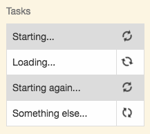
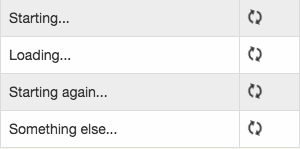

# css-animation-sync [](https://travis-ci.org/bealearts/css-animation-sync) [](http://badge.fury.io/js/css-animation-sync) [](https://david-dm.org/bealearts/css-animation-sync)

Synchronise and control CSS Animations


# The Problem

When DOM elements styled with the same CCS Animation are added to the document at different times, the animations are out of synchronisation.

|Problem|Solution|
|-------|--------|
|Elements added at different times are out of sync|Adding `sync('spinner');`|
|||

Interactive [Example](https://gitcdn.link/repo/bealearts/css-animation-sync/master/example/index.html)

# Usage
```js
import sync from 'css-animation-sync';

sync('spinner');
```

# Install
```shell
npm install css-animation-sync --save
```

# API

* `const animation = new sync(animationName [, options])` - Synchronises all DOM elements using a CSS animation

    * `animationName` Name of the CSS animation to sync

    Options


    Returns an animation instance (see below)

* `animation.free()` - Stops synchronisation of DOM elements using the animation

* `animation.pause()` - Pause the animation of DOM elements using the animation


# Test
```shell
npm install
npm test
```
